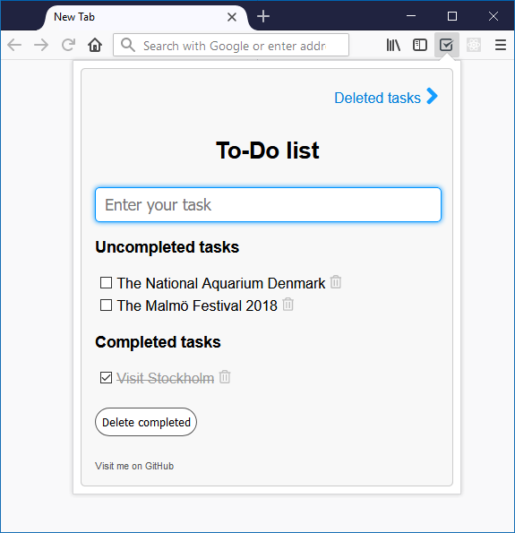

# Firefox extension - gToDos 

This extension is based on these packages:

|Main dependence|Version|Packages|
|---|---|---|
|[React](https://reactjs.org/)|16.11.0|react, react-dom|
|[Redux](https://redux.js.org/)|4.0.4|redux|
|[React-Redux](https://redux.js.org/basics/usagewithreact)|5.0.7|react-redux|
|[react-pretence-router](https://github.com/nguyenkhois/react-pretence-router)|1.0.5|[react-pretence-router](https://www.npmjs.com/package/react-pretence-router)|
|[g-jslib](https://github.com/nguyenkhois/library/tree/master/javascript)|1.2.3|[g-jslib](https://www.npmjs.com/package/g-jslib)|
|Babel|6.26.3|babel-core|
|Babel Loader|7.1.5|babel-loader|
|Webpack|4.41.2|webpack|
|Webpack Dev Server|3.9.0|webpack-dev-server|

## Usage
* The commands:
    * `npm install` - Installs all needed dependencies.
    * `npm run start` - Starts Webpack Dev Server by the development mode.
    * `npm run build` - Bundles your app into the folder `/dist` by the production mode.
* Local web server is started at `htpp://localhost:9000`
